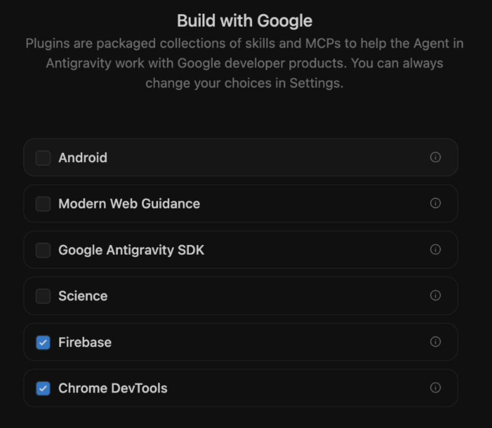
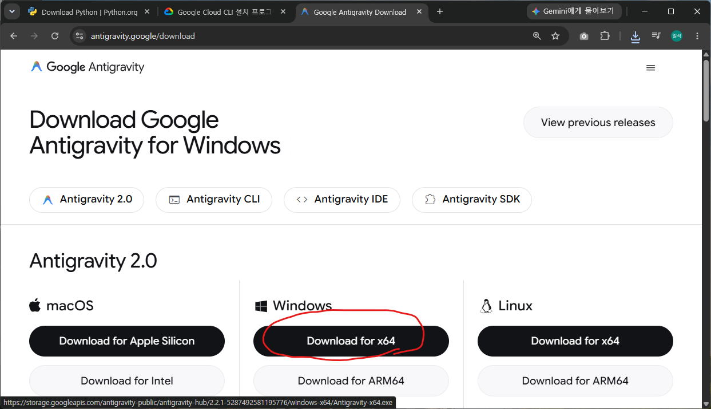

# 사전준비

Antigravity의 실행 환경은 결국 사용자의 로컬환경(PC, Mac)입니다. 로컬에서 Antigravity가 움직이려면 도구가 필요합니다. 코드를 실행, Google Cloud 작업, 커멘드 라인 작업 등 **실습에 필요한 아래 도구들을 실습전에 설치해 오시면 시간을 아낄 수 있습니다**. 설치가 되었는지 확인해보고 설치되어있다면 넘어가도 됩니다. 

* [Antigravity 2.0 설치](#antigravity-20-설치)
* [Node.js 설치]

## Antigravity 2.0 설치 

### 확인 

Windows 시작메뉴에서 Antigravity를 입력하여 설치가 되어 있는지 확인 합니다. 실행 후 "Use Google Cloud project instead"를 선택하여 아래 정보를 이용해서 로그인 해주세요. ~~Continue with Google 은 개인 계정과 연결되니 사용하지말아주세요.~~

 * 사용 ID: <사번>@hankooktech.com
 * Project ID: hk-hands-on
 * Location: global


Antigravity 2.0 에서 사용할 Skills, MCP를 큰 카테고리로 설정합니다. **Science 빼고 모두 선택**




### 설치

[Download Google Antigravity for WindowsDownload Google Antigravity for Windows](https://antigravity.google/download)페이지에서 "Download for x64"를 클릭하여 다운로드 합니다. 



## Node.js 설치 

### 확인 

Windows Terminal 을 열어서 아래 명령으로 설치를 확인합니다. 

```

```