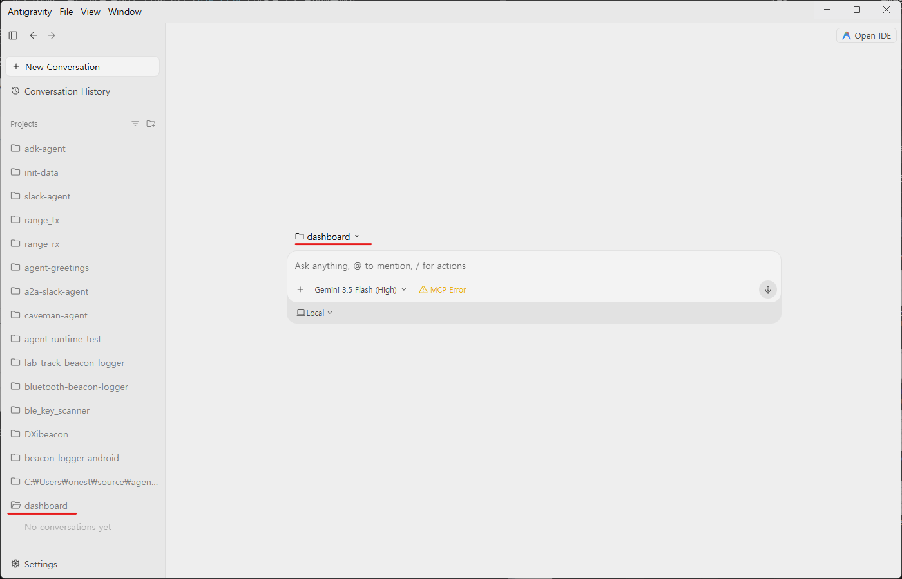
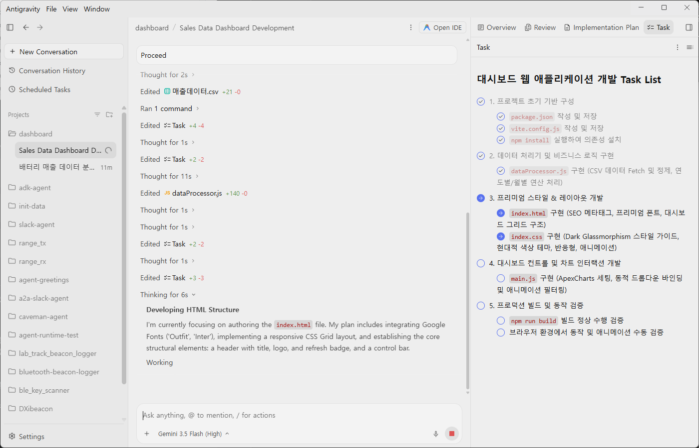
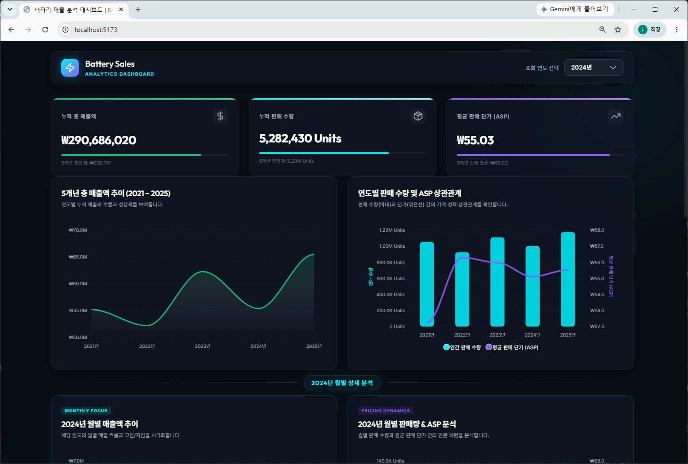

# 대시보드 만들기 

[매출데이터 CSV 파일](./data/매출데이터.csv)은 지역, 거래선별 2021년부터 2025년까지의 매출데이터 입니다. 이 데이터를 활용하여 기본 대시보드 화면을 웹앱 기반으로 만들어 보겠습니다. 

## 1. Antigravity 2.0 실행 

Antigravity 2.0을 실행하고 Login 합니다. 아직 설치가 안되어 있다면 [0 사전준비](./0%20사전준비.md)의 내용을 보고 설치해주세요. 

## 2. Antigravity 2.0 New Project 

로컬 PC에 **새폴더**를 만들고 지정하여 **dashboard**이라는 이름으로 새 프로젝트를 만듭니다. **Security Settings** 는 Default 로 설정합니다. 




## 3. 매출 데이터 다운로드

매출 데이터를 다운로드 받아 **새로만든 dashboard 폴더에 복사**합니다. 

[매출데이터](https://github.com/ilseokoh/antigravity-web-app-hands-on/blob/main/data/%EB%A7%A4%EC%B6%9C%EB%8D%B0%EC%9D%B4%ED%84%B0.csv) 페이지에서 오늘쪽 위 다운로드 (download raw file) 버튼을 클릭


## 4. 터미널에서 Google Cloud 로그인 

Windows Terminal을 열어서 아래 2가지 명령을 **각각** 입력하여 Google Cloud에 로그인 합니다. 브라우저가 자동으로 열립니다. 

```
gcloud auth login
```

```
gcloud auth application-default login
```

```
gcloud config set project hk-hands-on
```

## 5. 대시보드 생성

먼저 단순한 지표를 차트로 확인할 수 있는 대시보드를 생성해보겠습니다. 
데이터를 살펴보면 년도별, 월별, 총판별 데이터가 있습니다. 예제 프롬프트를 참조하여 대시보드를 만들어 보세요. 


 * 메모장에 먼저 작성을 하는 것도 좋은 방법입니다. 
 * Antigravity 에 직접 입력할 때는 Shift + Enter 로 줄바꿈을 합니다. 
 * Antigravity 2.0은 먼저 Implementation Plan을 작성하기도 합니다. 
 * Plan을 확인하고 Preceed 시킵니다.
 * Antigravity 2.0은 Task 를 만들어 하나씩 수행해 나갑니다. 
 * 무작정 Submit 버튼을 누르기 보다는 어떤작업을 하는지 실펴봅니다. 
 * 사용할 만한 Skills/Tools 를 찾기도 합니다. 
 * Antigravity 2.0 이 중간에 자주 확인을 요청할 수 있습니다. 적절한 Action을 취해주세요. 
 * 스스로 브라우저로 테스트를 진행하기도 합니다. 
 

### 예제 프롬프트

```
당신은 웹 애플리케이션 개발자 입니다. 
data/매출데이터.csv 파일의 데이터를 사용하여 웹앱 기반의 대시보드를 만들어주세요. 

 - 기본 지표에 대한 내용을 차트와 함께 보여줍니다. 
 - 사용자가 년도를 선택하면 선택된 년의 월별 지표를 보여줍니다. 데이터는 2021년부터 2025년까지의 데이터가 포함되어 있습니다. 

대시보드에 포함될 내용 
 - 년도별 누적 총 매출액 (Total Revenue)
 - 년도별 누적 판매 수량 (Total Volume)
 - 년도별 평균 단가 (Average Selling Price)
 - 특정 년도의 월별 총 매출액 (Total Revenue)
 - 특정 년도의 월별 판매 수량 (Total Volume)
 - 특정 년도의 월별 평균 단가 (Average Selling Price)
```




### 결과물은 서로 다를 수 있습니다. 

우리가 목표를 주기는 했지만 어떤 개발 환경과 도구를 사용하라고 지시하지 않았기 때문입니다. 
실제 작업에서는 개발 환경을 상세히 작성하고 UI에 대한 내용도 별도 AI 도구를 사용하여 정확하게 작업할 수 있습니다. 



## 6. 추가 대시보드 개발 

이런 질문들에 답을 얻을 수 있는 대시보드를 자유롭게 추가해서 개발해보세요. 

1. 매출액과 판매 수량은 월별로 어떤 흐름을 보이며, 특정 시기에 집중되는 계절성이 존재하나요?
1. 전년 동기 대비(YoY) 실적은 어떻게 변화하고 있나요? 올해 실적은 작년 대비 성장세인가요?
1. 제품의 평균 판매 단가(수량 대비 매출액)는 시기별로 일정하게 유지되고 있나요, 아니면 변동이 발생하고 있나요?
1. 제품의 중량 대비 매출 효율(연중량 단위당 매출액)은 어떻게 나타나나요? 물류 비용 대비 마진을 최적화할 수 있는 구간은 언제인가요?
1. 특정 지역, 총판, 제품 카테고리가 전체 실적에서 차지하는 비중은 얼마나 되며, 어떤 세그먼트가 가장 핵심 기여자인가요?

